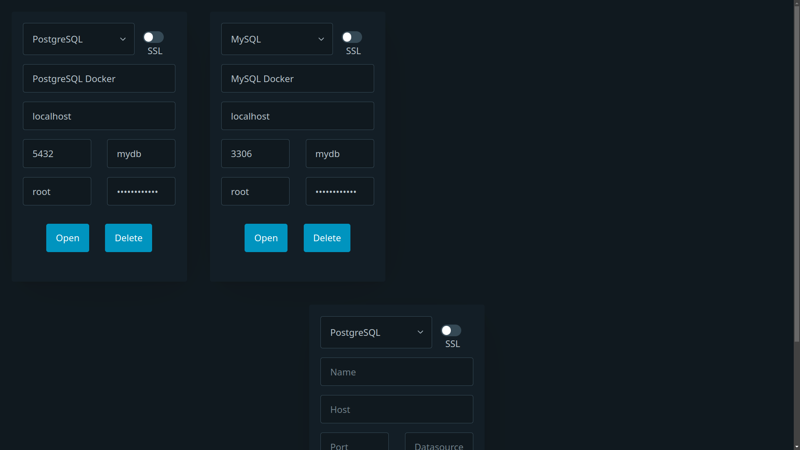
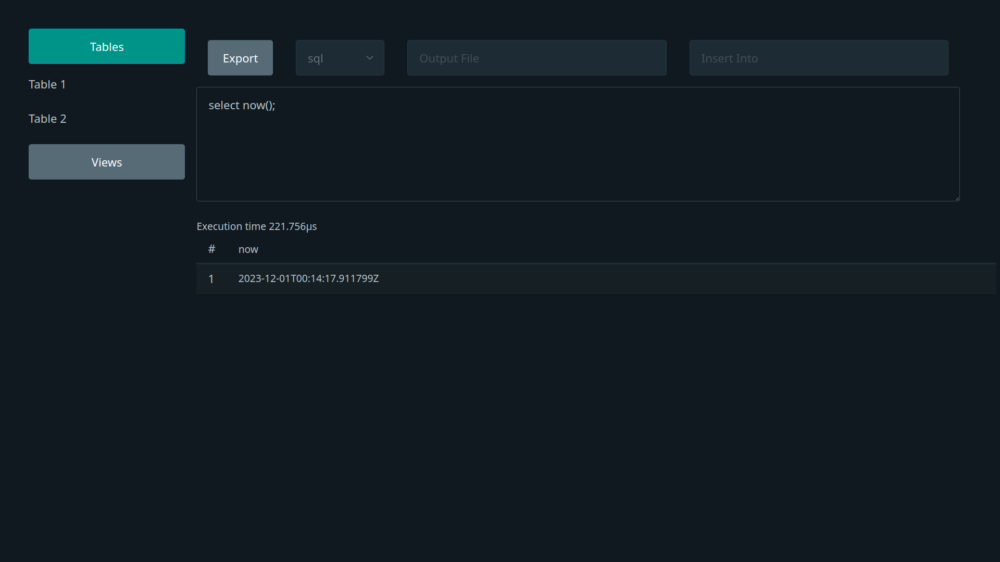

# GoSQLX
GoSQLXperience: A Seamless SQL Client Powered by Go and HTMX

*Removed `grid` styling from pico.css*

**[Dart-Sass v1.69.4](https://github.com/sass/dart-sass/releases/tag/1.69.4)**

![GoSQLX](data:image/svg+xml;base64,PHN2ZyB4bWxucz0iaHR0cDovL3d3dy53My5vcmcvMjAwMC9zdmciIHdpZHRoPSIxMjMuMjk2OTI3NDUyMDg3NCIgaGVpZ2h0PSIzNSIgdmlld0JveD0iMCAwIDEyMy4yOTY5Mjc0NTIwODc0IDM1Ij48cmVjdCB3aWR0aD0iNDIuNjU2MjY5MDczNDg2MzMiIGhlaWdodD0iMzUiIGZpbGw9IiM4NmQ0ZGUiLz48cmVjdCB4PSI0Mi42NTYyNjkwNzM0ODYzMyIgd2lkdGg9IjUwLjY0MDY0OTc5NTUzMjIzIiBoZWlnaHQ9IjM1IiBmaWxsPSIjZGE2NGM1Ii8+PHRleHQgeD0iMjEuMzI4MTM0NTM2NzQzMTY0IiB5PSIxNy41IiBmb250LXNpemU9IjEyIiBmb250LWZhbWlseT0iJ1JvYm90bycsIHNhbnMtc2VyaWYiIGZpbGw9IiNGRkZGRkYiIHRleHQtYW5jaG9yPSJtaWRkbGUiIGFsaWdubWVudC1iYXNlbGluZT0ibWlkZGxlIiBsZXR0ZXItc3BhY2luZz0iMiI+R088L3RleHQ+PHRleHQgeD0iNjcuOTc2NTkzOTcxMjUyNDQiIHk9IjE3LjUiIGZvbnQtc2l6ZT0iMTIiIGZvbnQtZmFtaWx5PSInTW9udHNlcnJhdCcsIHNhbnMtc2VyaWYiIGZpbGw9IiNGRkZGRkYiIHRleHQtYW5jaG9yPSJtaWRkbGUiIGZvbnQtd2VpZ2h0PSI5MDAiIGFsaWdubWVudC1iYXNlbGluZT0ibWlkZGxlIiBsZXR0ZXItc3BhY2luZz0iMiI+U1FMPC90ZXh0PjxyZWN0IHg9IjkzLjI5NjkxODg2OTAxODU1IiB3aWR0aD0iMzAuMDAwMDA4NTgzMDY4ODQ4IiBoZWlnaHQ9IjM1IiBmaWxsPSIjNWJiN2YwIi8+PHRleHQgeD0iMTA4LjI5NjkyMzE2MDU1Mjk4IiB5PSIxNy41IiBmb250LXNpemU9IjEyIiBmb250LWZhbWlseT0iJ1JvYm90bycsIHNhbnMtc2VyaWYiIGZpbGw9IiNGRkZGRkYiIHRleHQtYW5jaG9yPSJtaWRkbGUiIGZvbnQtd2VpZ2h0PSI1MDAiIGFsaWdubWVudC1iYXNlbGluZT0ibWlkZGxlIiBsZXR0ZXItc3BhY2luZz0iMiI+WDwvdGV4dD48L3N2Zz4=)

# GoSQLXperience: Lightweight and Speedy SQL Client

Are you tired of bulky SQL clients that consume excessive resources, slow down your system, and make you wait ages for startup? Introducing **GoSQLXperience**, a sleek and efficient SQL client written in Golang and powered by HTMX.

## Why GoSQLXperience?

- **Lightweight Installation**: Say goodbye to hefty installation packages. GoSQLXperience provides a minimal footprint, ensuring a swift and hassle-free setup.

- **Resource Efficiency**: Unlike traditional SQL clients that hog your RAM during execution, GoSQLXperience is designed to be resource-efficient, leaving your system responsive and ready for action.

- **Instant Access**: Launch the Golang server, and you're instantly connected to your SQL database through the browser on localhost. No more waiting for sluggish startup times.

## Features

- **Fast Server Launch**: Benefit from the speed of Golang. The server launches quickly, allowing you to dive into your SQL tasks without delay.

- **Intuitive Browser Interaction**: Interact seamlessly with the SQL client directly in your browser. No need for heavyweight desktop applications—access and manage your databases effortlessly.

- **Simplified User Interface**: Enjoy a clean and straightforward user interface that focuses on essential features without unnecessary bloat. Execute queries and view results with ease.

## Get Started

1. **Clone the Repository**: Simply clone this repository to your local machine.

2. **Launch the Golang Server**: Run the Golang server, and you're ready to roll.

3. **Access Locally**: Open your browser and navigate to localhost to start interacting with your SQL databases in a lightweight and responsive environment.

## Screenshots

## Contribute

GoSQLXperience is an open-source project, and we welcome contributions. Whether you're a Golang enthusiast, an HTMX aficionado, or simply eager to improve the SQL client experience, your contributions are valuable.

Experience SQL interaction in a new light—lightweight, fast, and efficient. Upgrade to GoSQLXperience today!
